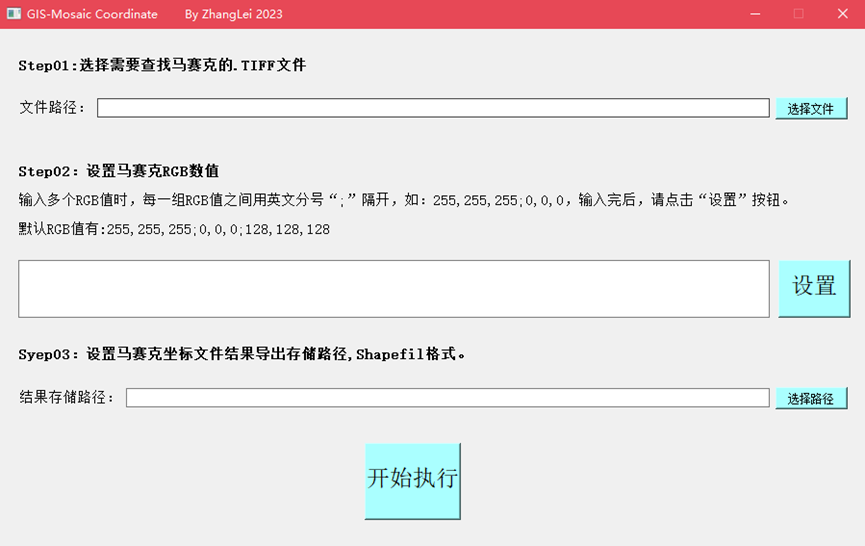
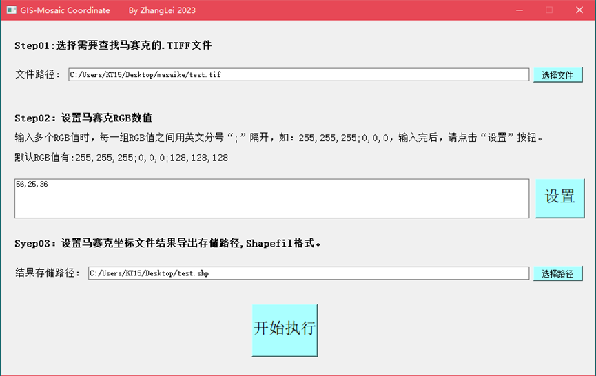
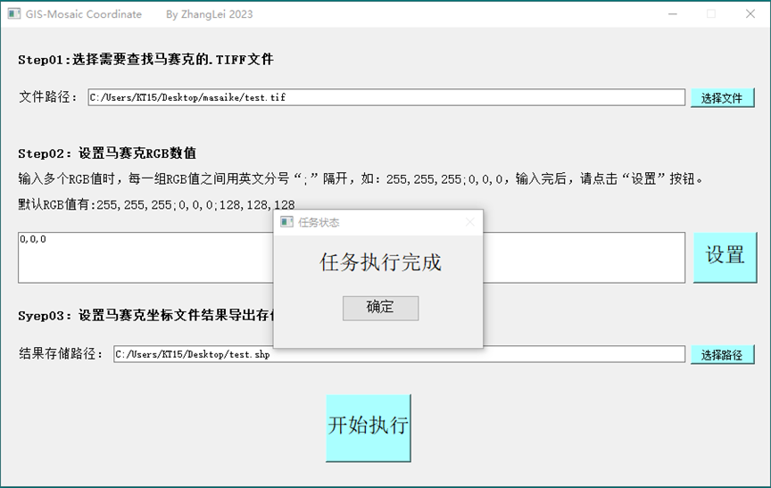
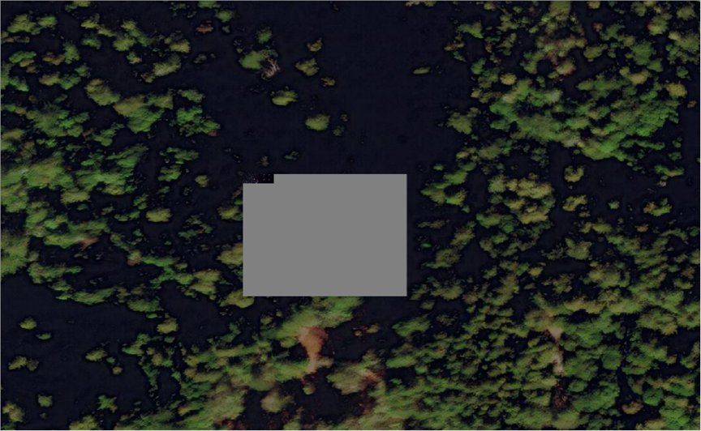
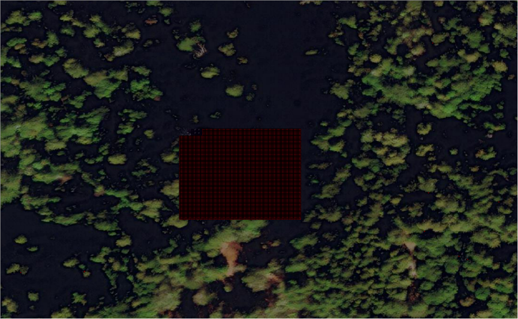

# Mosaic_Coordinate_GUI

查找影像数据中马赛克坐标，生成shp结果文件。(目前仅支持3波段影像数据)

GIS-Mosaic_Coordinate软件说明  
1.重要提示  
本软件在处理完整的一景影像数据时，其消耗的时间较长，经测试处理完整的一景影像需要45-60分钟左右，测试数据为taiwan0.5m-DOM。  
其中消耗时间较长为2个环节：1.读取马赛克坐标csv文件、2.马赛克坐标csv文件转Shapefile文件。  
建议利用下班后，或者周末的时间使用该软件处理完整的影像数据任务。  
2.使用方法  
2.1设置说明  

Step01, Step02,Step03均为必填项，且Step02的“设置”按钮为必点按钮。  
注意：Step02不能为空，如只想使用默认值时，可以在输入框填写任意一组RGB值，再点击“设置”按钮，必须点击“设置”按钮，否则程序会崩溃！！！

2.2设置  

Step01, Step02,Step03设置完成，且点击了“设置”按钮后，再点击“开始执行”按钮，此时软件进入运行状态。  

2.3软件“未响应”状态  

注意：在处理较大的影像数据任务时，在任务未执行完成时，程序会显示“未响应”状态，此时不要点击软件，忽略此状态，直至任务执行完成。  

2.4任务执行完成  

任务执行完成后，会显示“任务状态-任务执行完成”提示弹窗，点击“确定”按钮关闭此弹窗后，本次任务执行完成。  

2.5结果SHP文件  

任务执行完成后，最终结果的SHP文件保存在Step03设置的文件路径中查看。  
将SHP文件加载到GIS相关软件中查看结果。  

3.马赛克坐标查找效果  
图1为存在马赛克问题的影像数据。(灰色区域)

图1 存在马赛克问题的影像数据--灰色区域为马赛克

图2为使用该软件找到马赛克的具体位置效果(红色区域)

图2 找到马赛克的具体位置效果--红色区域  